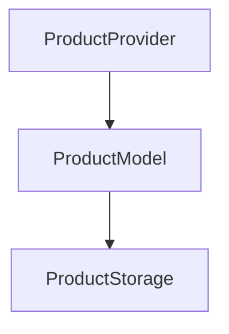

# Webwijs Magento 2 Synchronizer

De **Webwijs Magento 2 Synchronizer** koppeling is een framework voor in Magento 2 om productdata en orders te synchroniseren tussen Magento 2 en externe systemen.

De synchronizer is modulair opgezet zodat het mogelijk is om verschillende systemen aan te sluiten zonder de code die met Magento 2 communiceert opnieuw te moeten schrijven.

Voor het synchroniseren van de productinformatie ziet de structuur er als volgt uit

In het geval van

De ADPM koppeling importeert automatisch producten vanuit de AutoDisk PricingManager webservice. Dit gebeurd op **profiel** niveau. In de instellingen van de koppeling kan ingesteld worden welke AutoDisk PricingManager profielen er geïmporteerd moeten worden.

Klik [hier](stappen) voor meer informatie over de specifieke stappen die de ADPM koppeling onderneemt om de producten van de AutoDisk PricingManager naar Wordpress te krijgen.

    Dit project wordt actief doorontwikkeld

