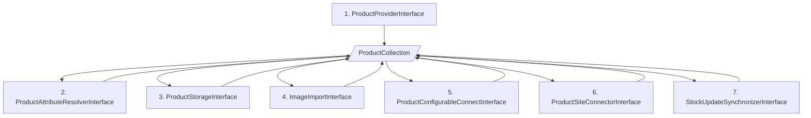

# ProductSynchronizer

Het synchroniseren van producten gebeurt in een aantal stappen, hieronder beschreven.

1. De **ProductProviderInterface** haalt de productgegevens op uit de bron, bijvoorbeeld een kassasysteem of een PIM. Hij maakt voor de opgehaalde productinformatie een ProductCollection object aan dat gevuld wordt met alle informatie die nodig is om de producten te importeren in Magento 2.
2. De **ProductAttributeResolverInterface** vormt de waardes van de aangeleverde attributen om naar de daadwerkelijke attributen in Magento. Bijvoorbeeld de **categorie ID's, BTW-klassen, kleuren en maten**.
3. De **ProductStorageInterface** slaat de producten op in de **database** van Magento 2.
4. De **ImageImportInterface** importeert de afbeeldingen van de producten.
5. De **ProductConfigurableConnectInterface** verbindt de simpele producten met de configureerbare producten.
6. De **ProductSiteConnectorInterface** verbindt de producten met de juiste websites
7. De **StockUpdateSynchronizerInterface** voert een initiële voorraadupdate uit voor de zojuist geïmporteerde producten.

