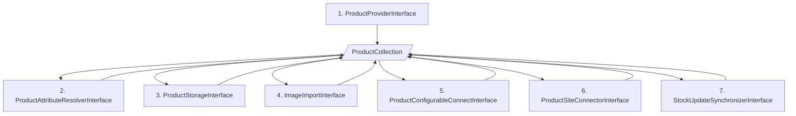
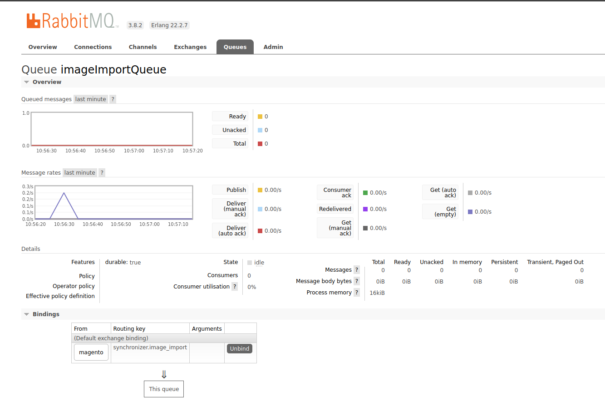

# ProductSynchronizer

Het synchroniseren van producten gebeurt in een aantal stappen, hieronder beschreven.

1. De **ProductProviderInterface** haalt de productgegevens op uit de bron, bijvoorbeeld een kassasysteem of een PIM. Hij maakt voor de opgehaalde productinformatie een ProductCollection object aan dat gevuld wordt met alle informatie die nodig is om de producten te importeren in Magento 2.
2. De **ProductAttributeResolverInterface** vormt de waardes van de aangeleverde attributen om naar de daadwerkelijke attributen in Magento. Bijvoorbeeld de **categorie ID's, BTW-klassen, kleuren en maten**.
3. De **ProductStorageInterface** slaat de producten op in de **database** van Magento 2.
4. De **ImageImportInterface** importeert de afbeeldingen van de producten.
5. De **ProductConfigurableConnectInterface** verbindt de simpele producten met de configureerbare producten.
6. De **ProductSiteConnectorInterface** verbindt de producten met de juiste websites
7. De **StockUpdateSynchronizerInterface** voert een initiële voorraadupdate uit voor de zojuist geïmporteerde producten.

## Gebruik
De ProductSynchronizer wordt aangeroepen via een CLI-commando. 

`php bin/magento synchronizer:products` 

Er zijn een aantal argumenten die je aan dit commando kan meegeven. 

Bij de SKU's is het belangrijk om alle de SKU's van de simpele producten die onder 1 configureerbare vallen mee te geven. 

Als je maar 1 SKU opgeeft wordt er maar 1 artikel opgehaald en wordt deze als individueel zichtbare Simple geïmporteerd.

| Argument | Waarde | Standaardwaarde                                                   | Uitleg                                                      |
| -------- | ------ |-------------------------------------------------------------------|-------------------------------------------------------------|
| sku (s) | string of kommagescheiden lijst van strings | null                                                              | De SKU's mee van de SIMPELE producten die je wil importeren |
| changed-since (c) | datum (2024-12-31) | null                                                              | Importeer alleen producten die gewijzigd zijn sinds deze datum |
| sync-marker (m) | int | De laatste sync-marker uit de database tabel (mplus_sync_markers) | Importeer alleen producten sinds deze sync-marker | 
| sync-marker-limit (ml) | int | null | Importeer alleen producten tot deze sync-marker |

## Afbeeldingen
Tijdens het importeren van de producten worden de afbeeldingen niet direct geïmporteerd. De reden hiervoor is dat het downloaden van de afbeeldingen relatief veel tijd in beslag neemt.

In plaats daarvan worden de afbeeldingen aan de (RabbitMQ) `imageImportQueue` wachtrij toegevoegd om later asynchroon geïmporteerd te worden.

Lees in de documentatie van Hypernode hoe je RabbitMQ gebruikt: https://docs.hypernode.com/best-practices/database/how-to-run-rabbitmq-on-hypernode.html

