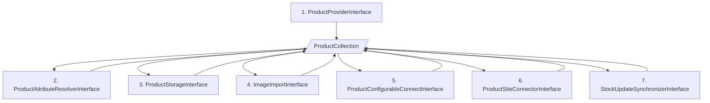
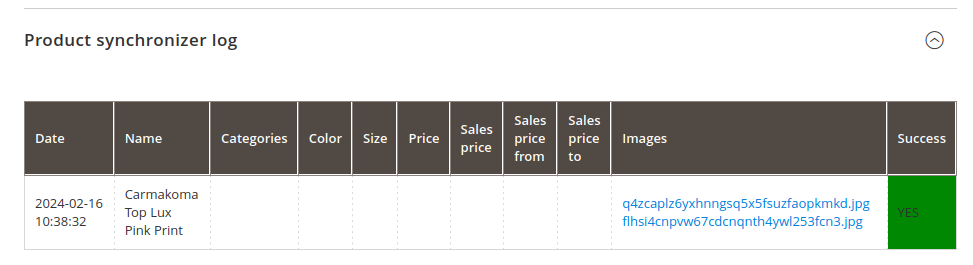
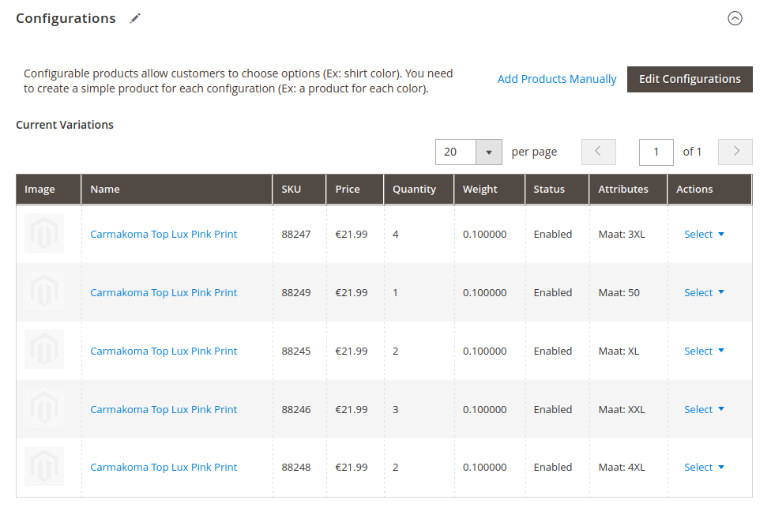

# ProductSynchronizer

Het synchroniseren van producten gebeurt in een aantal stappen, hieronder beschreven.

1. De **ProductProviderInterface** haalt de productgegevens op uit de bron, bijvoorbeeld een kassasysteem of een PIM. Hij maakt voor de opgehaalde productinformatie een ProductCollection object aan dat gevuld wordt met alle informatie die nodig is om de producten te importeren in Magento 2.
2. De **ProductAttributeResolverInterface** vormt de waardes van de aangeleverde attributen om naar de daadwerkelijke attributen in Magento. Bijvoorbeeld de **categorie ID's, BTW-klassen, kleuren en maten**.
3. De **ProductStorageInterface** slaat de producten op in de **database** van Magento 2.
4. De **ImageImportInterface** importeert de afbeeldingen van de producten.
5. De **ProductConfigurableConnectInterface** verbindt de simpele producten met de configureerbare producten.
6. De **ProductSiteConnectorInterface** verbindt de producten met de juiste websites
7. De **StockUpdateSynchronizerInterface** voert een initiële voorraadupdate uit voor de zojuist geïmporteerde producten.

## Implementatie

### ProductProviderInterface
De huidige implementatie van de `ProductProviderInterface` is `Webwijs\M2MplusSynchronizer\Product\MplusProductProvider`.

Deze doet het volgende:
1. Haalt de productgegevens op uit de MplusKassa API. Indien er geen argumenten worden meegegeven gebruikt hij de laatste SyncMarker uit de database.
2. Bepaalt welke producten individueel zichtbaar moeten zijn.
3. Prijzen van de artikelen worden bepaald.
4. Levert een collectie aan van configureerbaren en simpele producten. 

### ProductAttributeResolverInterface
De huidige implementatie van de `ProductAttributeResolverInterface` bevat resolvers voor de volgende attributen:
1. `Webwijs\M2ProductSynchronizer\Attribute\Ugly9YardsCategoryResolver`: Bepaalt de productcategorieën op basis van 3 attributen.
2. `Webwijs\M2ProductSynchronizer\Attribute\ProductAttributeSetResolver`: Bepaalt de attribuutset op basis van de productcategorieën.
3. `Webwijs\M2ProductSynchronizer\Attribute\TaxClassResolver`: Bepaalt de BTW-klasse op basis van het BTW-percentage.
4. `Webwijs\M2ProductSynchronizer\Attribute\ColorResolver`: Bepaalt de kleur van het product. Bepaalt ook of kleur een configureerbaar attribuut is.
5. `Webwijs\M2ProductSynchronizer\Attribute\SizeResolver`: Bepaalt de maat van het product. Bepaalt ook of de maat een configureerbaar attribuut is.

### ProductStorageInterface
De huidige implementatie van de `ProductStorageInterface` is `Webwijs\M2ProductSynchronizer\MagmiProductStorage`. Deze zorgt ervoor dat de ProductCollection wordt omgezet naar een (vlakke) array die geschikt is voor Magmi, alvorens het door Magmi te laten importeren.

## Gebruik
De ProductSynchronizer wordt aangeroepen via een CLI-commando. 

`php bin/magento synchronizer:products` 

Er zijn een aantal argumenten die je aan dit commando kan meegeven. 

Bij de SKU's is het belangrijk om alle de SKU's van de simpele producten die onder 1 configureerbare vallen mee te geven. 

Als je maar 1 SKU opgeeft wordt er maar 1 artikel opgehaald en wordt deze als individueel zichtbare Simple geïmporteerd.

| Argument | Waarde | Standaardwaarde                                                   | Uitleg                                                      |
| -------- | ------ |-------------------------------------------------------------------|-------------------------------------------------------------|
| sku (s) | string of kommagescheiden lijst van strings | null                                                              | De SKU's mee van de SIMPELE producten die je wil importeren |
| changed-since (c) | datum (2024-12-31) | null                                                              | Importeer alleen producten die gewijzigd zijn sinds deze datum |
| sync-marker (m) | int | De laatste sync-marker uit de database tabel (mplus_sync_markers) | Importeer alleen producten sinds deze sync-marker | 
| sync-marker-limit (ml) | int | null | Importeer alleen producten tot deze sync-marker |

## Afbeeldingen
Tijdens het importeren van de producten worden de afbeeldingen niet direct geïmporteerd. De reden hiervoor is dat het downloaden van de afbeeldingen relatief veel tijd in beslag neemt.

In plaats daarvan worden de afbeeldingen aan de (RabbitMQ) `imageImportQueue` wachtrij toegevoegd om later asynchroon geïmporteerd te worden.

De afbeeldingen worden alleen op de configureerbare producten geplaatst. Dit moet later eventueel uitgebreid worden als klanten ook kleur als configureerbaar attribuut willen gebruiken.

Lees in de documentatie van Hypernode hoe je RabbitMQ gebruikt: https://docs.hypernode.com/best-practices/database/how-to-run-rabbitmq-on-hypernode.html

### Geen afbeeldingen geïmporteerd?
Soms komt het voor dat een import niet goed opgepakt wordt. Als een product geen afbeeldingen heeft, maar je ziet bij "Product synchronizer log" wel afbeeldingsnamen staan betekent het dat de afbeeldingen wel aangeboden zijn, maar niet succesvol geïmporteerd

Dit kan meestal eenvoudig hersteld worden door het product nog een keer handmatig te importeren.

Noteer alle SKU's van de simpele producten die onder de configureerbare zonder afbeeldingen vallen en roep de product synchronizer aan via de command line.

`php bin/magento synchronizer:products --sku=88247,88249,88245,88246,88248`

De producten zullen opnieuw geïmporteerd worden en de afbeeldingen zullen opnieuw aan de wachtrij toegevoegd worden.

